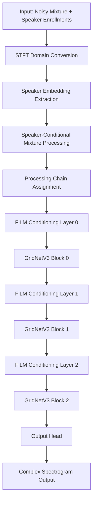

# 08 - Model Architecture

This document provides a comprehensive deep dive into the MCxTFGridNet model architecture, detailing every component from input processing through speaker embeddings, FiLM conditioning, and the complete forward pass to output generation.

## Table of Contents

1. [Architecture Overview](#architecture-overview)
2. [Model Configuration](#model-configuration)
3. [Input Processing & Embedding](#input-processing--embedding)
4. [Speaker Embedding Extraction](#speaker-embedding-extraction)
5. [Speaker-Conditional Processing](#speaker-conditional-processing)
6. [FiLM Layer Conditioning](#film-layer-conditioning)
7. [GridNetV3 Blocks](#gridnetv3-blocks)
8. [Multi-Head Attention](#multi-head-attention)
9. [Processing Chains & Output Heads](#processing-chains--output-heads)
10. [Complete Data Flow](#complete-data-flow)
11. [Memory & Computational Analysis](#memory--computational-analysis)
12. [Architecture Limitations & Optimizations](#architecture-limitations--optimizations)

## Architecture Overview

The MCxTFGridNet (Multi-Channel x Time-Frequency GridNet) is a speaker-conditional target speaker extraction model designed for multi-speaker scenarios. It processes STFT-domain inputs and produces separated spectrograms for each enrolled speaker.

### Core Design Principles

1. **Speaker Conditioning**: Each speaker gets dedicated processing pathways
2. **STFT Domain Processing**: Frequency-domain separation for better spectral modeling
3. **Multi-Channel Input**: Supports 4-channel hearing aid recordings
4. **Attention-Based Embeddings**: Advanced speaker enrollment processing
5. **FiLM Conditioning**: Feature-wise Linear Modulation for speaker adaptation

### Architecture Hierarchy

```
MCxTFGridNet
├── SpeakerConditionalConv2d     # Mixture conditioning
├── spk_conv                     # Speaker enrollment processing
├── AuxEncoder                   # Speaker embedding extraction
├── speaker_fusions[]            # Per-speaker FiLM layers
├── speaker_gridnets[]           # Per-speaker GridNetV3 blocks  
└── speaker_output_heads[]       # Per-speaker output generation
```

## Model Configuration

### Current Configuration (from `config/train/model.yaml`)

```yaml
params:
  n_srcs: 3                      # Number of speaker processing chains
  n_imics: 4                     # Input microphone channels
  n_layers: 3                    # GridNetV3 layers per chain
  lstm_hidden_units: 128         # LSTM hidden dimensions
  attn_n_head: 4                 # Multi-head attention heads
  attn_qk_output_channel: 128    # Attention Q/K channels
  emb_dim: 64                    # Embedding dimension
  emb_ks: 4                      # Embedding kernel size
  emb_hs: 1                      # Embedding hop size
  activation: prelu              # Activation function
  eps: 1.0e-05                   # Layer normalization epsilon
```

### Initialization Process

```python
def __init__(self, n_srcs=3, n_imics=4, n_layers=3, lstm_hidden_units=128, 
             attn_n_head=4, attn_qk_output_channel=128, emb_dim=64, ...):
    """
    Initialize the multi-speaker conditional separation model
    
    Args:
        n_srcs: Number of target speakers (processing chains)
        n_imics: Number of input microphone channels  
        n_layers: Number of TFGridNetV3 blocks per speaker chain
        emb_dim: Speaker embedding and feature dimension
    """
    super().__init__()
    self.n_srcs = n_srcs  # Current: 3 processing chains
    self.n_layers = n_layers  # Current: 3 layers per chain
    self.n_imics = n_imics  # Current: 4 microphone channels
    
    # Initialize per-speaker processing chains
    self.speaker_fusions = nn.ModuleList([])      # FiLM layers per speaker
    self.speaker_gridnets = nn.ModuleList([])     # GridNet blocks per speaker  
    self.speaker_output_heads = nn.ModuleList([]) # Output heads per speaker
    
    # Create n_srcs parallel processing chains
    for speaker_idx in range(n_srcs):
        layer_fusions = nn.ModuleList([])
        layer_gridnets = nn.ModuleList([])
        
        for layer_idx in range(n_layers):
            # FiLM conditioning layer
            layer_fusions.append(FiLM(emb_dim, emb_dim))
            
            # GridNetV3 processing block
            layer_gridnets.append(GridNetV3Block(
                emb_dim, emb_ks, emb_hs, lstm_hidden_units,
                n_head=attn_n_head, qk_output_channel=attn_qk_output_channel,
                activation=activation, eps=eps
            ))
        
        self.speaker_fusions.append(layer_fusions)
        self.speaker_gridnets.append(layer_gridnets)
        
        # Output head: emb_dim -> 2 channels (real/imaginary)
        self.speaker_output_heads.append(
            nn.ConvTranspose2d(emb_dim, 2, kernel_size=(3,3), padding=(1,1))
        )
```

## Input Processing & Embedding

### Input Format

The model receives two primary inputs:

```python
def forward(self, spec: torch.Tensor, spk: torch.Tensor, spk_lens: torch.Tensor):
    """
    Args:
        spec: [B, M, T, F, 2] - Multi-channel mixture STFT (M=n_imics=4)
        spk:  [B, K, T, F, 2] - Speaker enrollments STFT (K=num_speakers)  
        spk_lens: [B, K] - Valid lengths for speaker enrollments
    
    Returns:
        S_hat_c: [B, K, T, F] complex - Separated spectrograms
    """
```

### Mixture Processing Pipeline

```python
# 1. Extract mixture dimensions
B, M, T, F, RI = spec.shape  # M=4 channels, RI=2 (real/imag)
mixture_features = spec.permute(0, 1, 4, 2, 3)  # [B, M, 2, T, F]
mixture_features = mixture_features.reshape(B, M * 2, T, F)  # [B, 8, T, F]

# 2. Speaker-conditional mixture convolution (initial processing)
# Note: This layer conditions mixture processing on speaker embeddings
z = self.speaker_conditional_conv(mixture_features, speaker_embedding)
```

### Speaker-Conditional Convolution

```python
class SpeakerConditionalConv2d(nn.Module):
    """
    Conditions mixture processing on speaker identity from the very first layer.
    Allows each speaker to have personalized mixture analysis.
    """
    
    def __init__(self, in_channels, out_channels, kernel_size, padding, conditioning_dim):
        super().__init__()
        # Base mixture processing 
        self.base_conv = nn.Conv2d(in_channels, out_channels, kernel_size, padding=padding)
        
        # Speaker conditioning projection
        self.conditioning_proj = nn.Linear(conditioning_dim, out_channels)
        
        # Normalization
        self.norm = LayerNormalization(out_channels, eps=eps)
    
    def forward(self, mixture_features, speaker_embedding):
        """
        Args:
            mixture_features: [B, C_in, T, F] - STFT mixture (C_in = M*2 = 8)
            speaker_embedding: [B, conditioning_dim] - Speaker embedding (emb_dim=64)
        
        Returns:
            conditioned_features: [B, C_out, T, F] - Speaker-conditioned mixture
        """
        # Base convolution on mixture
        base_features = self.base_conv(mixture_features)  # [B, emb_dim, T, F]
        
        # Speaker conditioning
        speaker_condition = self.conditioning_proj(speaker_embedding)  # [B, emb_dim]
        speaker_condition = speaker_condition.unsqueeze(-1).unsqueeze(-1)  # [B, emb_dim, 1, 1]
        
        # Apply conditioning via gating (multiplicative)
        conditioned_features = base_features * (1.0 + speaker_condition)
        
        # Layer normalization
        return self.norm(conditioned_features)  # [B, emb_dim, T, F]
```

## Speaker Embedding Extraction

### Enrollment Processing Pipeline

```python
# 1. Speaker enrollment preprocessing  
spk_feat = spk.permute(0, 1, 4, 2, 3).reshape(B * K, 2, T, F)  # [BK, 2, T, F]

# 2. Initial convolution for speaker features
spk_feat = self.spk_conv(spk_feat)  # [BK, emb_dim, T, F]

# 3. Extract speaker embeddings via AuxEncoder
speaker_embeddings, _ = self.aux_enc(spk_feat, spk_lens, B, K)  # [BK, emb_dim]
speaker_embeddings = speaker_embeddings.view(B, K, -1)  # [B, K, emb_dim]
```

### AuxEncoder Architecture

The AuxEncoder extracts compact speaker representations from variable-length enrollment audio.

```python
class AuxEncoder(nn.Module):
    """
    Advanced speaker embedding extraction with attention pooling.
    Handles variable-length rainbow passages efficiently.
    """
    
    def __init__(self, emb_dim, num_spks):
        super().__init__()
        
        # Multi-scale feature extraction
        self.aux_enc = nn.ModuleList([
            EnUnetModule(emb_dim, emb_dim, (1, 5), (1, 3), scale=4),  # Coarse features
            EnUnetModule(emb_dim, emb_dim, (1, 3), (1, 3), scale=3),  # Medium features  
            EnUnetModule(emb_dim, emb_dim, (1, 3), (1, 3), scale=2),  # Fine features
            EnUnetModule(emb_dim, emb_dim, (1, 3), (1, 3), scale=1),  # Finest features
        ])
        
        # Attention pooling mechanism
        self.attention = nn.Sequential(
            nn.Linear(emb_dim, emb_dim // 2),
            nn.Tanh(),
            nn.Linear(emb_dim // 2, 1)  # Attention scores
        )
        
        # Output projection
        self.out_conv = nn.Linear(emb_dim, emb_dim)
        self.speaker = nn.Linear(emb_dim, num_spks)  # Speaker classification head
    
    def forward(self, auxs: torch.Tensor, aux_lengths: torch.Tensor, B: int, K: int):
        """
        Args:
            auxs: [BK, emb_dim, T, F] - Speaker enrollment features
            aux_lengths: [BK] - Valid lengths after STFT processing
            B, K: Batch size and number of speakers
        
        Returns:
            speaker_embeddings: [BK, emb_dim] - Compact speaker representations
            speaker_logits: [BK, num_spks] - Speaker classification scores
        """
        # 1. Multi-scale feature extraction
        aux_lengths = (((aux_lengths // 3) // 3) // 3) // 3  # Account for downsampling
        auxs = auxs.transpose(2, 3)  # [BK, emb_dim, F, T] for conv processing
        
        for i, enc_layer in enumerate(self.aux_enc):
            auxs = enc_layer(auxs)  # Progressive feature extraction
        
        # auxs: [BK, emb_dim, T', F'] after multi-scale processing
        
        # 2. Attention pooling for variable-length sequences
        BK, C, T, n_freqs = auxs.shape
        
        # Reshape for attention: [BK, C, T*F] -> [BK, T*F, C]
        x = auxs.view(BK, C, T * n_freqs).transpose(1, 2)
        
        # Compute attention weights
        attn_weights = self.attention(x).squeeze(-1)  # [BK, T*F]
        attn_weights = F.softmax(attn_weights, dim=-1)  # Normalize attention
        
        # Apply attention pooling
        weighted_avg = torch.bmm(attn_weights.unsqueeze(1), x)  # [BK, 1, C]
        speaker_embeddings = weighted_avg.squeeze(1)  # [BK, emb_dim]
        
        # 3. Output projections
        speaker_embeddings = self.out_conv(speaker_embeddings)
        speaker_logits = self.speaker(speaker_embeddings)
        
        return speaker_embeddings, speaker_logits
```

### Attention Pooling Mechanism

The attention mechanism handles variable-length enrollment sequences:

```python
# Attention computation for each time-frequency bin
attn_scores = tanh(W1 * x + b1)  # [BK, T*F, emb_dim//2]
attn_weights = softmax(W2 * attn_scores + b2)  # [BK, T*F, 1] -> [BK, T*F]

# Weighted average over all time-frequency bins
embedding = Σ(attn_weights[i] * features[i])  # [BK, emb_dim]
```

This allows the model to focus on the most discriminative parts of the rainbow passage.

## Speaker-Conditional Processing

### Processing Chain Assignment

```python
for k in range(K):  # For each enrolled speaker
    # Get speaker embedding
    spk_emb = speaker_embeddings[:, k]  # [B, emb_dim]
    
    # Assign processing chain (bottleneck with n_srcs=3)
    chain_idx = min(k, self.n_srcs - 1)
    
    # Speaker-conditional mixture processing 
    z_k = self.speaker_conditional_conv(mixture_features, spk_emb)  # [B, emb_dim, T, F]
    
    # Process through speaker-specific layers
    for layer_idx in range(self.n_layers):
        # Apply FiLM conditioning
        z_k = self.speaker_fusions[chain_idx][layer_idx](spk_emb, z_k)
        
        # Apply GridNet processing
        z_k = self.speaker_gridnets[chain_idx][layer_idx](z_k)
    
    # Generate output spectrogram
    output_k = self.speaker_output_heads[chain_idx](z_k)  # [B, 2, T, F]
    speaker_outputs.append(output_k)
```

### Chain Assignment Logic

Current configuration with `n_srcs=3`:

| Speaker Index | Processing Chain | Status |
|---------------|------------------|---------|
| k=0 | Chain 0 | ✅ Dedicated |
| k=1 | Chain 1 | ✅ Dedicated |  
| k=2 | Chain 2 | ✅ Dedicated |
| k=3 | Chain 2 | ⚠️ Shared |
| k=4+ | Chain 2 | ⚠️ Shared |

**Bottleneck Analysis**: Speakers 3+ all use Chain 2, potentially degrading separation quality.

## FiLM Layer Conditioning

FiLM (Feature-wise Linear Modulation) layers provide speaker-specific adaptation of mixture features.

### FiLM Architecture

```python
class FiLM(nn.Module):
    """
    Feature-wise Linear Modulation for speaker conditioning.
    Applies speaker-specific scaling (gamma) and shifting (beta) to features.
    """
    
    def __init__(self, cond_dim, feature_dim, eps=1e-5):
        super().__init__()
        
        # Speaker embedding -> scaling parameters
        self.gamma_fc = nn.Linear(cond_dim, feature_dim)
        
        # Speaker embedding -> shifting parameters  
        self.beta_fc = nn.Linear(cond_dim, feature_dim)
        
        # Initialize for stable training
        nn.init.ones_(self.gamma_fc.weight)   # Start with identity scaling
        nn.init.zeros_(self.gamma_fc.bias)
        nn.init.zeros_(self.beta_fc.weight)   # Start with zero shift
        nn.init.zeros_(self.beta_fc.bias)
    
    def forward(self, cond, x):
        """
        Args:
            cond: [B, cond_dim] - Speaker embedding (emb_dim=64)
            x: [B, C, T, F] - Input features (C=emb_dim=64)
        
        Returns:
            modulated_x: [B, C, T, F] - Speaker-conditioned features
        """
        # Generate speaker-specific parameters
        gamma = self.gamma_fc(cond).unsqueeze(-1).unsqueeze(-1)  # [B, C, 1, 1]
        beta = self.beta_fc(cond).unsqueeze(-1).unsqueeze(-1)   # [B, C, 1, 1]
        
        # Apply feature-wise linear modulation
        modulated_x = gamma * x + beta
        
        return modulated_x
```

### FiLM Parameter Analysis

The model logs FiLM parameters for debugging:

```python
# During first forward pass
logging.info("--- Inspecting FiLM Layer ---")
logging.info(f"Gamma (scale): mean_abs = {gamma.abs().mean():.2e}, max_abs = {gamma.abs().max():.2e}")
logging.info(f"Beta (shift):  mean_abs = {beta.abs().mean():.2e}, max_abs = {beta.abs().max():.2e}")
```

**Interpretation**:
- **Gamma ≈ 1.0**: Identity scaling (no modulation)
- **Gamma >> 1.0**: Feature amplification for this speaker
- **Gamma << 1.0**: Feature suppression for this speaker  
- **Beta ≈ 0.0**: No bias shift
- **Beta != 0.0**: Speaker-specific bias adjustment

## GridNetV3 Blocks

GridNetV3 blocks form the core processing units, combining intra-frame and inter-frame modeling with multi-head attention.

### GridNetV3 Architecture

```python
class GridNetV3Block(nn.Module):
    """
    Advanced time-frequency processing block with:
    - Intra-frame modeling (bidirectional LSTM)
    - Inter-frame modeling (unidirectional LSTM) 
    - Multi-head self-attention
    """
    
    def __init__(self, emb_dim, emb_ks, emb_hs, hidden_channels, 
                 n_head=4, qk_output_channel=128, activation="prelu", eps=1e-5):
        super().__init__()
        
        in_channels = emb_dim * emb_ks  # 64 * 4 = 256
        
        # Intra-frame processing (frequency axis)
        self.intra_norm = nn.LayerNorm(emb_dim, eps=eps)
        self.intra_rnn = nn.LSTM(
            in_channels, hidden_channels, 1, 
            batch_first=True, bidirectional=True  # Bidirectional for frequency
        )
        self.intra_linear = self._create_projection(hidden_channels * 2, emb_dim, emb_ks, emb_hs)
        
        # Inter-frame processing (time axis)  
        self.inter_norm = nn.LayerNorm(emb_dim, eps=eps)
        self.inter_rnn = nn.LSTM(
            in_channels, hidden_channels, 1,
            batch_first=True, bidirectional=False  # Unidirectional for causality
        )
        self.inter_linear = self._create_projection(hidden_channels, emb_dim, emb_ks, emb_hs)
        
        # Multi-head self-attention
        E = qk_output_channel  # 128
        assert emb_dim % n_head == 0
        
        self.attn_conv_Q = nn.Conv2d(emb_dim, n_head * E, 1)
        self.attn_conv_K = nn.Conv2d(emb_dim, n_head * E, 1) 
        self.attn_conv_V = nn.Conv2d(emb_dim, n_head * emb_dim, 1)
        self.attn_conv_O = nn.Conv2d(n_head * emb_dim, emb_dim, 1)
        
        # Normalization for attention
        self.attn_norm_Q = LayerNormalization4D(n_head * E, eps=eps)
        self.attn_norm_K = LayerNormalization4D(n_head * E, eps=eps)
        self.attn_norm_V = LayerNormalization4D(n_head * emb_dim, eps=eps)
        
        self.n_head = n_head
        self.E = E
```

### GridNetV3 Forward Pass

```python
def forward(self, x):
    """
    Args:
        x: [B, C, T, F] - Input features (C=emb_dim=64)
    
    Returns:
        output: [B, C, T, F] - Processed features
    """
    B, C, old_T, old_Q = x.shape
    
    # 1. Padding for kernel/stride alignment
    olp = self.emb_ks - self.emb_hs  # Overlap
    T = math.ceil((old_T + 2 * olp - self.emb_ks) / self.emb_hs) * self.emb_hs + self.emb_ks
    Q = math.ceil((old_Q + 2 * olp - self.emb_ks) / self.emb_hs) * self.emb_hs + self.emb_ks
    
    x = F.pad(x, (0, Q - old_Q, 0, T - old_T))  # [B, C, T, Q]
    
    # Store for residual connection
    residual = x
    
    # 2. Intra-frame processing (frequency modeling)
    x = self.intra_norm(x.transpose(-2, -1)).transpose(-2, -1)  # Layer norm
    
    # Unfold frequency dimension for LSTM processing
    x = x.unfold(-1, self.emb_ks, self.emb_hs)  # [B, C, T, Q', emb_ks]
    x = x.reshape(B, C * T, Q', self.emb_ks)  # Flatten for LSTM
    
    # Bidirectional LSTM on frequency axis
    x, _ = self.intra_rnn(x.view(-1, Q', C * self.emb_ks))  # [B*C*T, Q', 2*hidden]
    x = self.intra_linear(x)  # Back to feature dimension
    x = x.view(B, C, T, Q')  # Reshape back
    
    # 3. Inter-frame processing (time modeling)  
    x = self.inter_norm(x.transpose(-3, -2)).transpose(-3, -2)  # Layer norm
    
    # Unfold time dimension for LSTM processing
    x = x.unfold(-2, self.emb_ks, self.emb_hs)  # [B, C, T', Q, emb_ks]  
    x = x.reshape(B, C * Q, T', self.emb_ks)  # Flatten for LSTM
    
    # Unidirectional LSTM on time axis (causal)
    x, _ = self.inter_rnn(x.view(-1, T', C * self.emb_ks))  # [B*C*Q, T', hidden]
    x = self.inter_linear(x)  # Back to feature dimension  
    x = x.view(B, C, T', Q)  # Reshape back
    
    # 4. Multi-head self-attention
    x = self._multi_head_attention(x)
    
    # 5. Residual connection
    output = x + residual
    
    # 6. Crop back to original size
    return output[:, :, :old_T, :old_Q]
```

## Multi-Head Attention

### Attention Mechanism

```python
def _multi_head_attention(self, x):
    """
    Multi-head self-attention for global context modeling
    
    Args:
        x: [B, C, T, F] - Input features
        
    Returns:
        attended_x: [B, C, T, F] - Attention-enhanced features
    """
    B, C, T, F = x.shape
    
    # Generate Q, K, V
    Q = self.attn_norm_Q(self.attn_conv_Q(x))  # [B, n_head*E, T, F]
    K = self.attn_norm_K(self.attn_conv_K(x))  # [B, n_head*E, T, F]  
    V = self.attn_norm_V(self.attn_conv_V(x))  # [B, n_head*C, T, F]
    
    # Reshape for multi-head attention
    Q = Q.view(B, self.n_head, self.E, T, F)      # [B, n_head, E, T, F]
    K = K.view(B, self.n_head, self.E, T, F)      # [B, n_head, E, T, F] 
    V = V.view(B, self.n_head, C, T, F)           # [B, n_head, C, T, F]
    
    # Flatten spatial dimensions for attention
    Q = Q.flatten(3)  # [B, n_head, E, T*F]
    K = K.flatten(3)  # [B, n_head, E, T*F]
    V = V.flatten(3)  # [B, n_head, C, T*F]
    
    # Scaled dot-product attention
    scale = self.E ** -0.5
    scores = torch.matmul(Q.transpose(-2, -1), K) * scale  # [B, n_head, T*F, T*F]
    attn_weights = F.softmax(scores, dim=-1)  # Attention weights
    
    # Apply attention to values
    attended = torch.matmul(V, attn_weights.transpose(-2, -1))  # [B, n_head, C, T*F]
    
    # Reshape back to spatial dimensions
    attended = attended.view(B, self.n_head * C, T, F)  # [B, n_head*C, T, F]
    
    # Output projection
    output = self.attn_conv_O(attended)  # [B, C, T, F]
    
    return output
```

### Attention Pattern Analysis

The self-attention mechanism allows the model to:

1. **Global context**: Each time-frequency bin can attend to all other bins
2. **Long-range dependencies**: Capture relationships across distant time frames
3. **Spectral patterns**: Model frequency interactions for better separation
4. **Speaker-specific patterns**: Focus on characteristic spectral regions per speaker

## Processing Chains & Output Heads

### Output Head Architecture

```python
# Per-speaker output head (one per processing chain)
self.speaker_output_heads.append(
    nn.ConvTranspose2d(
        in_channels=emb_dim,     # 64
        out_channels=2,          # Real + Imaginary  
        kernel_size=(3, 3),      # 3x3 convolution
        padding=(1, 1)           # Same padding
    )
)
```

### Output Generation Process

```python
# For each speaker k using processing chain chain_idx
output_k = self.speaker_output_heads[chain_idx](z_k)  # [B, 2, T, F]

# Stack all speaker outputs
out_ri = torch.stack(speaker_outputs, dim=1)  # [B, K, 2, T, F]

# Convert to complex format
re = out_ri[:, :, 0].to(torch.float32)  # Real part [B, K, T, F]
im = out_ri[:, :, 1].to(torch.float32)  # Imaginary part [B, K, T, F]
S_hat_c = torch.complex(re, im)         # Complex spectrogram [B, K, T, F]
```

## Complete Data Flow

### End-to-End Processing Pipeline



### Detailed Data Flow

```python
def forward(self, spec, spk, spk_lens):
    """Complete forward pass with detailed tensor shapes"""
    
    # 1. Input processing
    B, M, T, F, _ = spec.shape  # [1, 4, 65, 128, 2] typical
    B, K, T_spk, F_spk, _ = spk.shape  # [1, 3, 200, 65, 2] typical
    
    # 2. Speaker embedding extraction
    spk_feat = spk.permute(0,1,4,2,3).reshape(B*K, 2, T_spk, F_spk)  # [3, 2, 200, 65]
    spk_feat = self.spk_conv(spk_feat)  # [3, 64, 200, 65]
    
    speaker_embeddings, _ = self.aux_enc(spk_feat, spk_lens, B, K)  # [3, 64]
    speaker_embeddings = speaker_embeddings.view(B, K, -1)  # [1, 3, 64]
    
    # 3. Mixture processing  
    mixture_features = spec.permute(0,1,4,2,3).reshape(B, M*2, T, F)  # [1, 8, 65, 128]
    
    # 4. Per-speaker processing
    speaker_outputs = []
    for k in range(K):
        spk_emb = speaker_embeddings[:, k]  # [1, 64]
        chain_idx = min(k, self.n_srcs - 1)  # Chain assignment
        
        # Speaker-conditional mixture processing
        z_k = self.speaker_conditional_conv(mixture_features, spk_emb)  # [1, 64, 65, 128]
        
        # Layer-by-layer processing
        for layer_idx in range(self.n_layers):
            # FiLM conditioning
            z_k = self.speaker_fusions[chain_idx][layer_idx](spk_emb, z_k)  # [1, 64, 65, 128]
            
            # GridNetV3 processing
            z_k = self.speaker_gridnets[chain_idx][layer_idx](z_k)  # [1, 64, 65, 128]
        
        # Output generation
        output_k = self.speaker_output_heads[chain_idx](z_k)  # [1, 2, 65, 128]
        speaker_outputs.append(output_k)
    
    # 5. Output stacking and conversion
    out_ri = torch.stack(speaker_outputs, dim=1)  # [1, 3, 2, 65, 128]
    S_hat_c = torch.complex(out_ri[:,:,0], out_ri[:,:,1])  # [1, 3, 65, 128] complex
    
    return S_hat_c
```

### Memory Layout Analysis

| Component | Input Shape | Output Shape | Parameters | Memory (MB) |
|-----------|-------------|--------------|------------|-------------|
| spk_conv | [3, 2, 200, 65] | [3, 64, 200, 65] | 1.2K | 15.0 |
| AuxEncoder | [3, 64, 200, 65] | [3, 64] | 85K | 33.2 |
| SpeakerConditionalConv | [1, 8, 65, 128] + [1, 64] | [1, 64, 65, 128] | 4.7K | 2.1 |
| FiLM Layer | [1, 64] + [1, 64, 65, 128] | [1, 64, 65, 128] | 8.2K | 2.1 |
| GridNetV3 Block | [1, 64, 65, 128] | [1, 64, 65, 128] | 180K | 2.1 |
| Output Head | [1, 64, 65, 128] | [1, 2, 65, 128] | 1.2K | 0.5 |

**Total per speaker chain**: ~280K parameters, ~55MB memory

**Full model (3 chains)**: ~850K parameters, ~165MB memory

## Memory & Computational Analysis

### Computational Complexity

```python
# Per forward pass (B=1, K=3, T=65, F=128)
operations = {
    "Speaker Embedding Extraction": 
        "O(BK * T_spk * F * emb_dim^2) = O(3 * 200 * 65 * 64^2) ≈ 160M",
    
    "Speaker-Conditional Conv":
        "O(BK * T * F * in_channels * out_channels) = O(3 * 65 * 128 * 8 * 64) ≈ 100M", 
    
    "FiLM Conditioning (per layer)":
        "O(BK * T * F * emb_dim) = O(3 * 65 * 128 * 64) ≈ 1.6M",
    
    "GridNetV3 Block (per layer)":
        "LSTM: O(BK * T * F * hidden^2) = O(3 * 65 * 128 * 128^2) ≈ 400M"
        "Attention: O(BK * (T*F)^2 * emb_dim) = O(3 * (65*128)^2 * 64) ≈ 3.5B",
    
    "Output Head":
        "O(BK * T * F * emb_dim * 2) = O(3 * 65 * 128 * 64 * 2) ≈ 3.2M"
}
```

**Total computational cost per forward pass**: ~4.2B FLOPs

### Memory Optimization Strategies

1. **Mixed Precision Training**: 
   ```python
   with autocast("cuda", dtype=torch.bfloat16):
       S_hat_c = model(noisy_tf, spk_all_for_model, spk_lens_all)
   ```
   **Benefit**: ~50% memory reduction

2. **Gradient Checkpointing**:
   ```python
   z_k = torch.utils.checkpoint.checkpoint(
       self.speaker_gridnets[chain_idx][layer_idx], z_k
   )
   ```
   **Benefit**: Trade compute for memory (~30% memory reduction)

3. **Sequential Processing**:
   ```python
   # Process speakers sequentially instead of parallel
   for k in range(K):
       with torch.no_grad():
           # Clear intermediate activations
           torch.cuda.empty_cache()
       speaker_output = process_speaker(k)
   ```
   **Benefit**: Linear memory scaling with speakers

## Architecture Limitations & Optimizations

### Current Limitations

1. **Processing Chain Bottleneck**:
   ```python
   # Current: n_srcs=3, but may have K>3 speakers
   chain_idx = min(k, self.n_srcs - 1)  # Speakers 3+ share chain 2
   ```
   **Impact**: Degraded separation quality for additional speakers
   
   **Solution**: Increase `n_srcs` or implement dynamic chain assignment

2. **Memory Scaling**: 
   - **Current**: O(B * K * T * F * emb_dim) memory usage
   - **Issue**: Linear scaling with number of speakers
   
   **Solutions**:
   - Speaker batching: Process speakers in sub-batches
   - Progressive processing: Process speakers sequentially

3. **Computational Complexity**:
   - **Attention**: O((T*F)^2) complexity for self-attention
   - **LSTM**: O(T*F) but with hidden state dependencies
   
   **Optimizations**:
   - Local attention: Limit attention to local windows
   - Sparse attention: Use attention sparsity patterns
   - Efficient LSTM: Use optimized LSTM implementations

### Recommended Improvements

1. **Dynamic Chain Assignment**:
   ```python
   # Instead of fixed assignment, use similarity-based grouping
   def assign_processing_chain(speaker_embedding, existing_chains):
       similarities = [cosine_similarity(speaker_embedding, chain_emb) 
                      for chain_emb in existing_chains]
       if max(similarities) > threshold:
           return argmax(similarities)  # Use most similar chain
       else:
           return create_new_chain()     # Create new chain if dissimilar
   ```

2. **Hierarchical Processing**:
   ```python
   # Process in stages: coarse -> fine separation
   coarse_separated = coarse_separation_model(mixture, speaker_embeddings)
   fine_separated = fine_separation_model(coarse_separated, speaker_embeddings)
   ```

3. **Attention Optimization**:
   ```python
   # Use local attention instead of global
   def local_attention(x, window_size=32):
       # Limit attention to local windows
       return attention(x, attention_mask=create_local_mask(window_size))
   ```

### Configuration Recommendations

For different scenarios:

**High-Quality Separation (GPU memory > 40GB)**:
```yaml
n_srcs: 6              # Support up to 6 speakers
n_layers: 4            # More processing layers
emb_dim: 128           # Larger embeddings
lstm_hidden_units: 256 # Larger LSTM
```

**Memory-Efficient Setup (GPU memory < 16GB)**:
```yaml
n_srcs: 3              # Keep current
n_layers: 2            # Fewer layers
emb_dim: 32            # Smaller embeddings
lstm_hidden_units: 64  # Smaller LSTM
```

**Balanced Performance (GPU memory ~24GB)**:
```yaml
n_srcs: 4              # Support 4 speakers
n_layers: 3            # Current layers
emb_dim: 64            # Current embedding
lstm_hidden_units: 128 # Current LSTM
```

---

This architecture provides sophisticated multi-speaker target extraction through speaker conditioning, attention mechanisms, and dedicated processing pathways, with extensive opportunities for optimization based on computational resources and requirements.